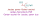
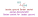
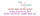

## Symbol previews

#### Jacdac power Gerber socket

#### Jacdac ground Gerber socket

#### Jacdac data Gerber socket

As of now, there are only `Jacdac bus` sockets,but in the future work we will follow with `Jacdac prog` sockets, as well.